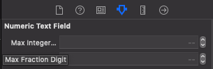

# KSNumericTextField

KSNumericTextField is a simple to use text field that only accept numeric value. You can also specify the maximum number of integer digits and faction digits using storyboard or code.


## Requirements
* Xcode 10 or later
* iOS 11.2 or later
* Swift 4.2 or later


## Features
* Easily limit number of integer digits and fraction digits
* Support Xcode storyboard


## Example
Clone or download the source code and launch the project with ```KSNumericTextFieldExample.xcworkspace```. The example demonstrate how to configure KSNumericTextField using storyboard or code.


## Installation
### CocoaPods
``` ruby
pod 'KSNumericTextField'
```

### Carthage
1. Create and update Cartfile
``` ruby
github "LeeKahSeng/KSNumericTextField"
```
2. Build the framework using terminal
```
carthage update
```
3. After finish building the framework using Carthage, open Xcode and select you project in the project navigator.
4. At ```Build Phases``` tab, add ```KSNumericTextField.framework``` to ```Link Binary with Libraries```.
5. At ```General``` tab, add ```KSNumericTextField.framework``` to ```Embedded Binaries```.

### Manually
1. Download the project.
2. Drag the ```Sources``` folder in ```\KSNumericTextField\KSNumericTextField``` into your Xcode project.
3. Add ```import UIKit``` to all the source code that causing compile error. 
4. Build & run.

## How to use
### Storyboard
1. Drag a UITextField to your view controller.
2. Open Indentity Inspector and change button class to KSNumericTextField.
3. Open Indentity Inspector and change button module to KSNumericTextField. (This step only required when install using CocoaPods or Carthage)
4. Open Attribute Inspector to change 'Max Integer Digit' and 'Max Fraction Digit' base on you needs.

5. Build & run.

### Code
Import KSNumericTextField if you are using CocoaPods or Carthage.
```swift
import KSNumericTextField
```
KSNumericTextField can be initialize and configure just like normal UITextField.
```swift
let textField = KSNumericTextField()
textField.frame = CGRect(x: 0.0, y: 0.0, width: 100.0, height: 44.0)
textField.maxIntegerDigit = 3
textField.maxFractionDigit = 1
view.addSubview(textField)
```


## License

This code is distributed under the terms and conditions of the [MIT license](LICENSE).
